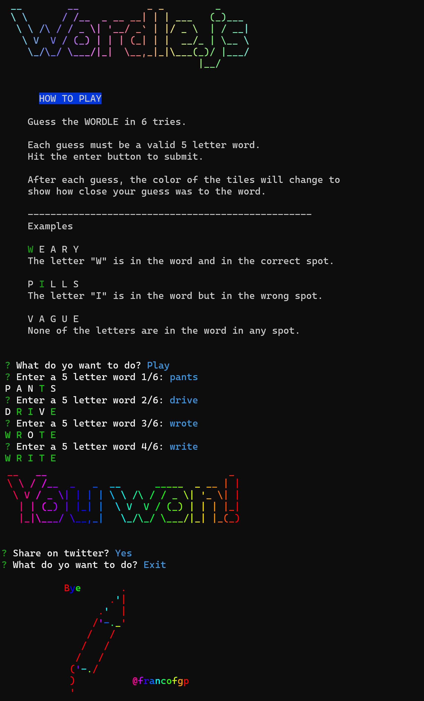

# Wordle in NodeJS
### **What is this wordle clone about?**

<br>

This is a clone of the famous game [Wordle](https://www.powerlanguage.co.uk/wordle/), that you can play on your console, made with NodeJS
<br>

-   Unlimited words per day 🤘.


<div align="center">


&nbsp;&nbsp;&nbsp;&nbsp;&nbsp;&nbsp;&nbsp;&nbsp;&nbsp;&nbsp;&nbsp;&nbsp;&nbsp;&nbsp;&nbsp;&nbsp;&nbsp;&nbsp;&nbsp;


</div>

- [Wordle in NodeJS](#wordle-in-nodejs)
    - [**What is this wordle clone about?**](#what-is-this-wordle-clone-about)
    - [Run the project](#run-the-project)
  - [Showcase](#showcase)
    - [Gif](#gif)
    - [Image](#image)
    - [Video](#video)
    - [Acknowledgements](#acknowledgements)
    - [License](#license)
  
### [Run the project](#Run-the-project)

---

Use [NPM](https://docs.npmjs.com/) to run the project:

```bash
npm install
node index.js
```


## [Showcase](#showcase)

---
A full play.
<br>
### Gif


### Image
 


### Video
https://user-images.githubusercontent.com/70602890/153481749-d4635c79-3c4e-4b78-8eaf-633c3cb5c5d5.mp4


### [Acknowledgements](#Acknowledgements)

---

-   [Chalk](https://github.com/chalk/chalk) 🖍 Terminal string styling done right.
-   [Chalk-animation](https://github.com/chalk/chalk) 🎬 Colorful animations in terminal output
-   [Inquirer](https://github.com/SBoudrias/Inquirer.js) 🖍 A collection of common interactive command line user interfaces.
-   [Figlet](https://github.com/patorjk/figlet.js) A FIG Driver written in JavaScript which aims to fully implement the FIGfont spec.
-   [Gradient-string](https://github.com/bokub/gradient-string) 🌈 Beautiful color gradients in terminal output.
-   [Open](https://github.com/sindresorhus/open) Open stuff like URLs, files, executables. Cross-platform.


### [License](#license)

Closures is provided under the [MIT License](https://github.com/vhesener/Closures/blob/master/LICENSE).

```text
MIT License
Copyright (c) 2022 Pértile Franco Giuliano
Permission is hereby granted, free of charge, to any person obtaining a copy
of this software and associated documentation files (the "Software"), to deal
in the Software without restriction, including without limitation the rights
to use, copy, modify, merge, publish, distribute, sublicense, and/or sell
copies of the Software, and to permit persons to whom the Software is
furnished to do so, subject to the following conditions:
The above copyright notice and this permission notice shall be included in all
copies or substantial portions of the Software.
THE SOFTWARE IS PROVIDED "AS IS", WITHOUT WARRANTY OF ANY KIND, EXPRESS OR
IMPLIED, INCLUDING BUT NOT LIMITED TO THE WARRANTIES OF MERCHANTABILITY,
FITNESS FOR A PARTICULAR PURPOSE AND NONINFRINGEMENT. IN NO EVENT SHALL THE
AUTHORS OR COPYRIGHT HOLDERS BE LIABLE FOR ANY CLAIM, DAMAGES OR OTHER
LIABILITY, WHETHER IN AN ACTION OF CONTRACT, TORT OR OTHERWISE, ARISING FROM,
OUT OF OR IN CONNECTION WITH THE SOFTWARE OR THE USE OR OTHER DEALINGS IN THE
SOFTWARE.
```

[MIT](https://choosealicense.com/licenses/mit/)